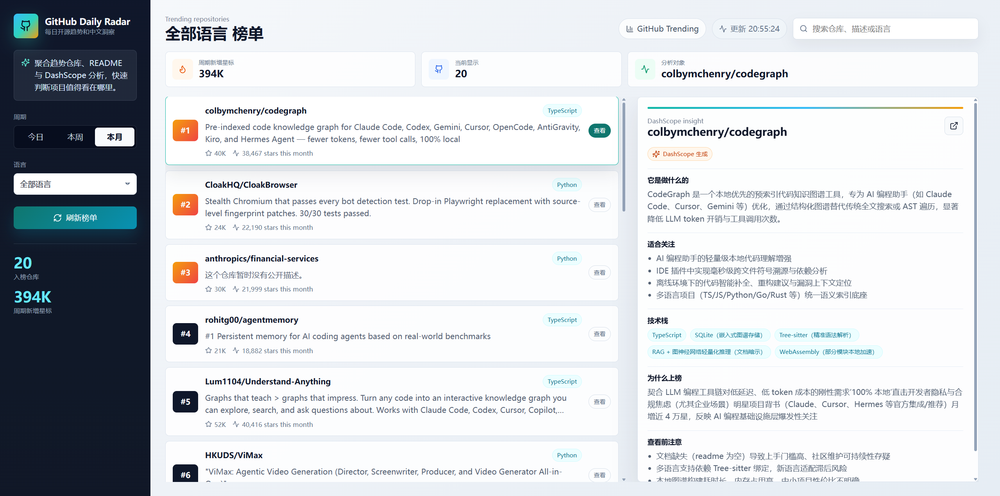
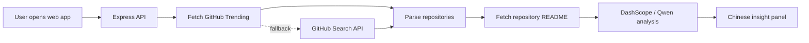

# GitHub Daily Radar

> 每天 3 分钟，看懂 GitHub 正在流行什么。

GitHub Daily Radar 是一个面向开发者、独立黑客和技术团队的开源趋势雷达。它会聚合 GitHub Trending 榜单，并结合 DashScope 对仓库 README 和元数据做中文分析，帮你快速判断：这个项目是做什么的、为什么突然火、技术栈是什么、值不值得继续看。

如果你也经常打开 GitHub Trending，却发现自己只是收藏了一堆“以后再看”的仓库，这个项目就是为你准备的。


## Why Star

- **趋势不止是榜单**：不只展示仓库，还解释它为什么值得关注。
- **中文友好**：把英文 README、项目描述和技术关键词转成更容易扫读的中文洞察。
- **AI 辅助判断**：DashScope 会总结用途、使用场景、技术栈、上榜原因和潜在风险。
- **开箱即用**：没有 DashScope Key 也能跑，自动降级成本地规则摘要。
- **更稳的数据策略**：GitHub Trending 页面不可用时，会尝试 GitHub Search API 备用排序。
- **适合二次开发**：前后端结构简单，方便接入日报、订阅、飞书/钉钉推送或团队知识库。

## Preview

项目当前是一个工作台式界面：

- 左侧固定筛选区：周期、语言、刷新、核心统计
- 中间榜单流：仓库排名、描述、星标变化
- 右侧分析区：DashScope 生成的中文项目解读



## Features

- 查看 GitHub 每日、每周、每月热门仓库
- 按语言筛选：JavaScript、TypeScript、Python、Go、Rust、Java 等
- 搜索仓库名、描述和语言
- 点击仓库后自动读取 README
- 使用 DashScope OpenAI 兼容接口生成中文分析
- 无 API Key 时提供本地摘要兜底
- 内置请求缓存，减少重复抓取和重复分析
- Trending 抓取失败时自动尝试 GitHub Search API

## Quick Start

```bash
git clone <your-repo-url>
cd github-trending-dashscope
npm install
cp .env.example .env
npm run dev
```

Windows PowerShell:

```powershell
Copy-Item .env.example .env
npm run dev
```

打开：

```text
http://localhost:5173
```

默认服务：

- Web: `http://localhost:5173`
- API: `http://localhost:3001`

## DashScope Setup

在 `.env` 中填写：

```env
DASHSCOPE_API_KEY=sk-your-dashscope-key
DASHSCOPE_MODEL=qwen-plus
PORT=3001
```

本项目使用 DashScope 的 OpenAI 兼容接口：

```text
https://dashscope.aliyuncs.com/compatible-mode/v1
```

如果你暂时不配置 `DASHSCOPE_API_KEY`，项目依然可以运行，只是分析结果会变成本地规则摘要。

## How It Works



分析字段包括：

- `summary`：这个仓库是做什么的
- `useCases`：适合关注的场景
- `techStack`：可能使用的技术栈
- `whyTrending`：为什么它可能正在变热
- `risks`：继续评估前需要注意什么

## API

### Get Trending Repositories

```http
GET /api/trending?language=All&since=daily
```

Query:

- `language`: `All`、`JavaScript`、`TypeScript`、`Python`、`Go`、`Rust` 等
- `since`: `daily`、`weekly`、`monthly`

### Analyze Repository

```http
POST /api/analyze
Content-Type: application/json
```

```json
{
  "repo": {
    "owner": "openai",
    "name": "openai-node",
    "fullName": "openai/openai-node"
  }
}
```

## Project Structure

```text
github-trending-dashscope/
├─ server/
│  └─ index.js          # Express API, GitHub fetch, DashScope analysis
├─ src/
│  ├─ main.jsx          # React UI
│  └─ styles.css        # Workbench layout and visual system
├─ .env.example
├─ package.json
└─ vite.config.js
```

## Scripts

```bash
npm run dev       # start API + Vite dev server
npm run build     # production build
npm run preview   # preview built frontend
npm start         # start API server only
```

## Roadmap

- [ ] 生成每日趋势报告
- [ ] 收藏仓库和稍后阅读
- [ ] 增加 star 增速图表
- [ ] 支持 GitHub Token，提高 API 限额
- [ ] 接入飞书、钉钉、邮件推送
- [ ] 支持按主题聚类：AI、DevTools、Infra、Frontend、Data
- [ ] 导出 Markdown / Notion / Obsidian 笔记

## Contributing

欢迎提交 issue、PR 或新想法。适合贡献的方向：

- 更精准的 Trending 解析策略
- 更好的 DashScope prompt
- 更多语言和主题筛选
- 更漂亮的截图和交互细节
- 部署模板：Vercel、Render、Docker

## Star History

如果这个项目帮你更快发现有价值的开源项目，欢迎点一个 star。它会让我知道这个小雷达值得继续升级。

## License

MIT
